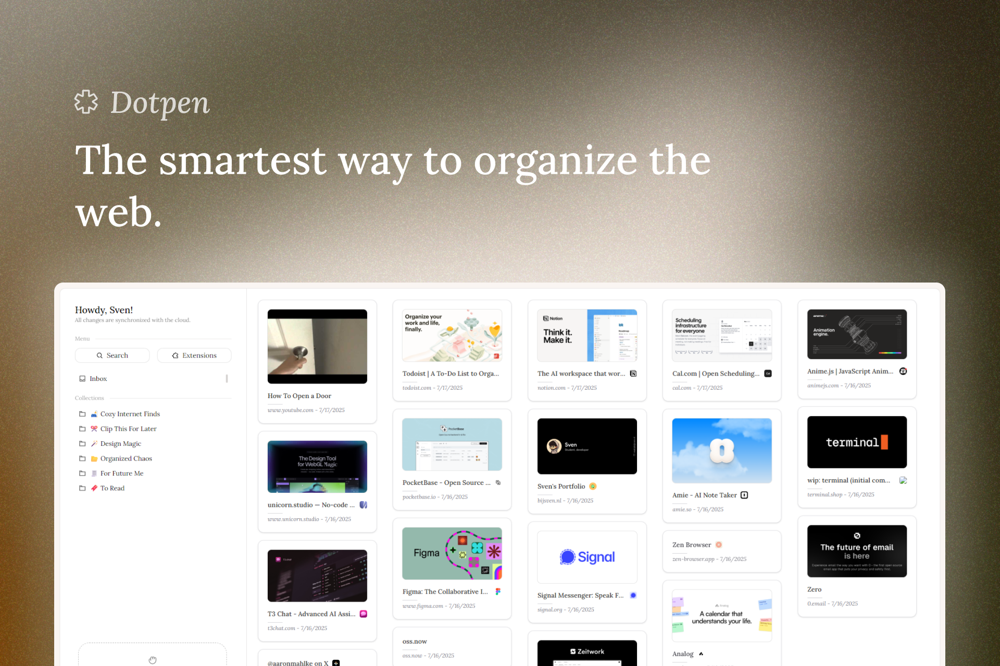

# 📤 Dotpen

The smartest way to organize the web, made for you. Beatifully designed, crazy fast navigation, and a lot more. Get started today at [dotpen.co](https://dotpen.co). ⚡

## ❔ What is Dotpen?

Dotpen is a web-based app with a focus on speed and simplicity. Dotpen is designed to help you organize your website and make it easier to navigate. With Dotpen, you can easily create a website structure that is easy to understand and navigate and you will never loose track of your content.

## 💡 Why Dotpen?

Most bookmarking tools are slow, chunky and cluttered. Dotpen is designed to be the smartest way to organize your website. It is fast, easy to use and has a lot of features that make it the best bookmarking tool out there. We use the power of simplicity and speed to make it an ease to use.

## 💻 Stack

Dotpen is built with the following technologies:

- **Front-end**: SvelteKit v5, TailwindCSS, TS and Vite.
- **Back-end**: Golang (extended with PocketBase)
- **AI Services**: Google Gemini 2.5 Flash Lite (with _soon_ support for locally hosted models.)

In the future we will try to make Dotpen switch to different backend technologies, with support for multiple concurrent users and more advanced features.

## 📦 Getting started

The quickest way to get started with Dotpen is to use our hosted version at [dotpen.co](https://dotpen.co). You can also download the source code and run it yourself.

### 🏠 Running Dotpen locally

##### Prerequisites

- Docker + Docker Compose Plugin
- To speed up the proces, a bit of technical knowledge is recommended.

1. Clone the repository

```bash
git clone https://github.com/dotpenapp/dotpen.git
```

2. Run the docker compose file

```bash
docker compose up --build
```

3. Check for errors, if there are any, report them to us.
4. Exit out of the attach with `Ctrl + C`
5. Open it again, via `docker compose up -d`
6. Open the browser and go to `localhost:5173`
7. 🎉 Congrats, you are now running Dotpen locally.
